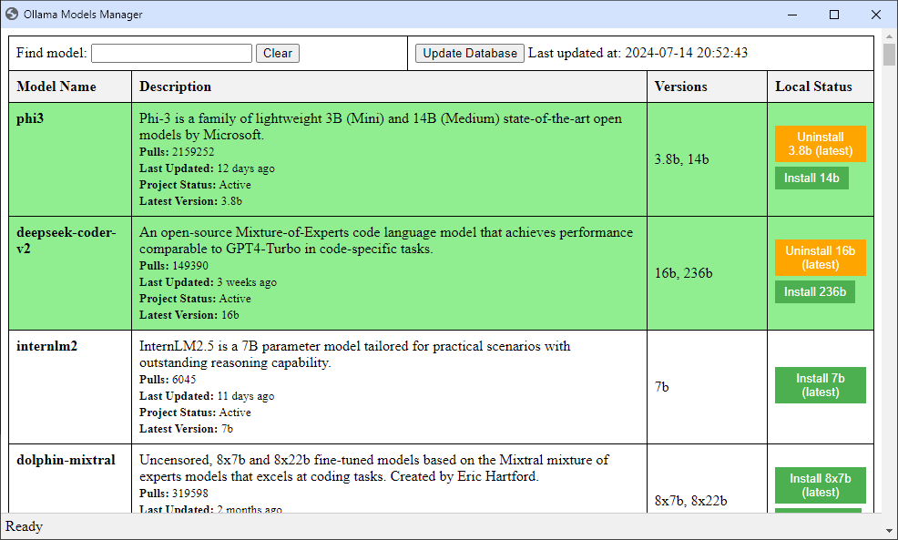

# Ollama Model Manager

Ollama Model Manager is a user-friendly desktop application for managing and interacting with Ollama AI models. It provides an easy-to-use interface for browsing, installing, and uninstalling Ollama models.

## Features

- Browse available Ollama models
- View detailed information about each model, including description, pull count, and last update date
- Install and uninstall models with a single click
- Search functionality to quickly find specific models
- Automatic detection of locally installed models
- Database update feature to fetch the latest model information

## Prerequisites

- Python 3.12+
- Ollama installed on your system

## Installation

1. Clone this repository
   
2. Navigate to the project directory:
	cd ollama-model-manager
3. Install the required dependencies
	pip install -r requirements.txt

## usage

1. Run the application:
	python main.py
2. The application will open in a new window, displaying the list of available Ollama models.

3. Use the search bar to find specific models.

4. Click the "Install" button next to a model to install it, or "Uninstall" to remove it.
  - This will open a console and send the install or uninstall command to Ollama for that model and version.
    
5. Use the "Update Database" button to fetch the latest model information from the Ollama website.

## Contributing

Contributions are welcome! Please feel free to submit a Pull Request.

## License

This project is licensed under the CC0 1.0 Universal License - see the [LICENSE](LICENSE) file for details.

## Acknowledgments

- [Ollama](https://ollama.ai/) for providing the AI models and inspiration for this project.
- [Eel](https://github.com/ChrisKnott/Eel) for enabling the creation of simple Electron-like desktop apps with Python and JavaScript.
- [Scrapy](https://scrapy.org/) for powering the web scraping functionality.

## Disclaimer

This project is not affiliated with, authorized, maintained, sponsored or endorsed by Ollama or any of its affiliates or subsidiaries. This is an independent and unofficial software. Use at your own risk.
